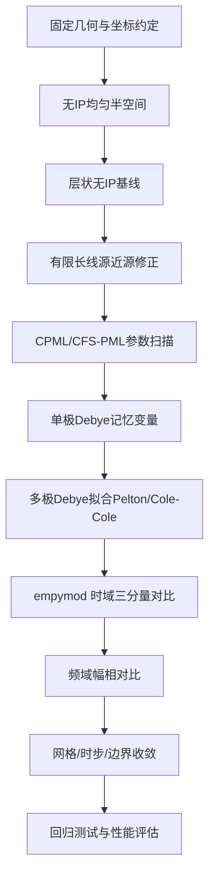

# 三维层状介质中电性源瞬变电磁近源带极化效应直接时域求解报告

## 执行摘要

就你给定的工况而言，真正困难的部分并不是“层状介质”本身，而是以下四件事同时出现：有限长直导线的近源强梯度与端点效应、关断型 TDEM 的初值/波形处理、低频长时窗下吸收边界的稳定吸收、以及 IP 频散本构在时域中的卷积记忆效应。近源装置本身具有更高信号强度、更高对地下电性的灵敏度，但场型也更复杂，直接场更强，参数提取与数值离散更容易失真；有限长细导线在邻近网格处还需要专门处理相邻磁场更新，不能把它简化成“普通点源”就草率进入三维时步。 citeturn24view2turn24view1turn22view0

对这个问题，最稳妥、最可实施的技术路线不是一步到位上“复杂三维带全 Cole-Cole 分数阶模型”，而是采用分层递进的验证型开发：先做**structured Yee 网格 + CPML/CFS-PML + 有限长线源 + 无 IP** 的直接时域基线；确认 Ex、Ey、Hz 三分量、单位、符号、波形和近源离散都正确以后，再加入**单极 Debye 记忆变量**；接着用**多极 Debye 拟合 Pelton/Cole-Cole**，最后如果你需要更大的时窗、更复杂边界或后续拓展到地形/非结构网格，再切换到**后退欧拉 FETD** 或 **CN-FDTD**。这一顺序与已有 TEM/FDTD、FETD 以及 IP-FDTD 文献的成熟路线一致：显式 Yee 在源离散和 PML 上最直接；隐式 FETD/CN-FDTD 则在大时窗问题上更稳定，但代价是大型稀疏线性系统与更复杂的实现。 citeturn20view0turn26view0turn28view0turn15view0

与 `empymod` 的对比验证必须坚持“从简单到复杂”的梯度：先做均匀半空间无 IP，再做层状无 IP，再做单极 Debye，再做多极 Debye/ Pelton-Cole-Cole；每一步同时比较**时域波形、频域幅相、误差随时间、误差随距离**。需要特别强调的是，工程上常把 `empymod` 称作“解析解基准”，但严格说它是**层状介质波数域半解析核 + Hankel/Fourier 变换**得到的高质量一维层状参考解；对你的问题，这已经是非常合适且公认的基准。 `empymod` 官方文档还明确支持有限长电/磁双极源、任意取向接收、时间域 switch-off 响应，以及通过 `func_eta` 等 hook 注入频率依赖电阻率模型。 citeturn10view8turn31view3turn33view1turn33view3

## 问题清单与总体路线

先把“已知”和“未指定”分开，是这个项目能否顺利推进的第一步。

| 类别 | 内容 |
|---|---|
| 已知 | 激发源为通电直导线；导线长度 50 m；测线与导线平行；偏移距 10 m；接收 Ex、Ey、Hz 三分量；必须使用吸收边界条件 |
| 未指定 | 层数、层厚、电导率/电阻率；是否存在各向异性；IP 采用 Debye / Pelton-Cole-Cole / Warburg / 分数阶何种模型；IP 参数 \(m,\tau,c\) 是否分层变化；源是否接地；源电流强度与关断波形；接收器高度、偶极长度、线圈面积；空气层是否显式建模；目标时窗；允许的误差门限；代码采用 FDTD / FETD / FV 哪一类离散 |

“未指定”并不是细枝末节。尤其是**源是否接地**与**关断波形**，直接决定你是要做“电性接地源 step-off”的 DC 初值问题，还是做“空中/绝缘导线 impressed current”的全 Maxwell 瞬态问题；而 IP 模型选型则决定你是用记忆变量、Padé 展开，还是更昂贵的分数阶历史项。近源 SOTEM/grounded-wire 文献强调，近源方法灵敏度高，但场型复杂、解释更难，因此参数和几何定义必须在建模前固定，而不能“边写边补”。 citeturn24view2turn24view1

下表把需要解决的核心问题、对应风险和建议解法浓缩到一处。

| 核心问题 | 典型风险 | 推荐处理 |
|---|---|---|
| 有限长直导线近源离散 | 源附近 Ex/Hz 畸变，端点效应被抹平 | 采用有限长细导线模型，直接在有源差分方程中加入电流密度，并对源邻近磁场分量做专门更新 |
| 关断波形与初值 | 把 step-off 错写成冲激，导致早期误差和符号错误 | 若为 step-off，先解 on-time/DC 初值；若仅做高斯脉冲/冲激验证，可用零初值 |
| 吸收边界低频失效 | 晚期数据被边界反射污染 | 主方案采用 CPML/CFS-PML；一阶 ABC 仅作 FEM 交叉验证或调试基线 |
| PML 与 IP 耦合 | PML 内再叠加一套 IP 记忆变量，内存与稳定性恶化 | 工程上优先把 PML 视作非极化耗散层，仅在物理域做 IP；若目标靠边界，则扩大物理域 |
| IP 本构模型不一致 | 自编代码与 `empymod` 参数等名不同义 | 明确使用 Pelton 还是 Cole-Cole conductivity form；不要混用 \(\tau\) 的定义 |
| 时步与时间窗 | 显式法迭代过多；隐式法大步长晚期失真 | 显式基线遵守 CFL；隐式法使用固定步块 + 步长加倍；必须做时间收敛 |
| Ex/Ey/Hz 三分量提取 | Yee 网格三分量不共点，插值误差进入验证 | 统一接收点插值规则，并在 `empymod` 侧匹配朝向/符号/归一化 |
| `empymod` 映射 | 源长、强度、坐标系、磁/电接收设置错位 | 固定版本、固定坐标约定、固定 `strength`、固定 `mrec/msrc`、固定 transform 方案 |

上表中的有限长线源、CPML、关断初值、步长策略和 `empymod` 映射都有明确的文献依据：细导线近邻磁场需要单独更新；CPML 在 TEM 中可显著减小节点数并吸收空气与地下低频波；step-off 初值通常来自 DC/Poisson；而 `empymod` 默认对源长和强度做归一化，若不显式设置 `strength`，就无法与你的真实 50 m 源一一对应。 citeturn22view0turn20view0turn42view2turn42view3turn12view2

## 关键物理与数学模型

### 场方程与近源建模的基本选择

若仅从地球物理常规 TEM 出发，很多代码在晚期使用低频近似或扩散方程；但你的问题是**近源、有限长线源、Ex/Ey/Hz 三分量、带 IP、还必须有吸收边界**。因此更安全的出发点是先写**一阶时域 Maxwell 系统**，再在验证后决定是否对极晚期单独切换到低频近似。中文 TEM/FDTD 文献和 `empymod`/SimPEG 等主流框架都明确表明：地球物理 TDEM 常在准静态条件下忽略位移电流，但这一近似是否成立取决于时窗、波形和介质参数；而近源极早期门更容易受全 Maxwell 项影响。 citeturn20view0turn18search0turn38search13

在一般形式下，可写成
\[
\nabla\times \mathbf{E}=-\partial_t\mathbf{B},
\qquad
\nabla\times \mathbf{H}=\mathbf{J}_s+\mathbf{J}_c+\partial_t\mathbf{D},
\]
\[
\mathbf{B}=\boldsymbol{\mu}\mathbf{H},
\qquad
\mathbf{D}=\boldsymbol{\epsilon}\mathbf{E}.
\]

对带 IP 的导电介质，导电电流不再是简单的 \(\mathbf{J}_c=\boldsymbol{\sigma}\mathbf{E}\)，而应写成带记忆核的时域卷积形式：
\[
\mathbf{J}_c(t)=\boldsymbol{\sigma}_{\infty}\mathbf{E}(t)+
\int_0^t \mathbf{K}_{\sigma}(t-\tau)\,\mathbf{E}(\tau)\,d\tau .
\]
这正是时域 IP 建模困难的根源：频域中的复电导乘法，在时域里变成了对全部历史场量的卷积。Commer 等在 3D IP-FDTD 中明确指出，若直接保存全部历史场并逐时卷积，时间和内存代价会迅速变得不可接受。 citeturn26view0turn27view4

### 带极化项的本构关系

你至少需要明确采用哪一类 IP 本构。`empymod` 官方文档给出了两类最常见写法。其一是**Cole-Cole conductivity form**：
\[
\sigma(\omega)=\sigma_\infty+\frac{\sigma_0-\sigma_\infty}{1+(i\omega\tau)^C},
\]
其二是勘探电磁里更常见的 **Pelton resistivity form**：
\[
\rho(\omega)=\rho_0\left[1-m\left(1-\frac{1}{1+(i\omega\tau)^C}\right)\right].
\]
二者形式相似，但**不是简单的互逆关系**；Tarasov 与 Titov 专门指出，两种常被统称为 Cole-Cole 的表达式在时间常数参数上含义不同，尤其在高极化率、小指数情形下差异会变大。因此，自编代码与 `empymod` 比较前，必须先锁定你到底使用“电导频散式”还是“Pelton 电阻率频散式”。 citeturn13view0turn13view1turn30view2

如果你的第一目标是把直接时域算法做稳，建议先从**单极 Debye**做起，即 \(C=1\) 的整数阶情形；然后再用多极 Debye 去逼近 \(0<C<1\) 的 Pelton/Cole-Cole。这样做的原因非常直接：Debye 模型在时域天然对应指数核，最适合递推记忆变量；而 true Cole-Cole 的非整数指数则更适合通过 Debye 拟合或 Padé 展开转成有限维 ODE 系统。Commer 的 3D FDTD 路线是 Debye 分解 + 复合记忆变量；Cai 的 FETD 路线则是对 Cole-Cole 用自适应 Padé 逼近。 citeturn27view1turn27view3turn28view0

### 关断波形、初始条件与时域目标量

如果你的 TDEM 是**关断响应**，数值代码就不能把 \(t=0^+\) 一概当成零场。Um 等的 FETD 工作明确指出：对 step-off 源，初始电场不是零，而是 on-time 直流/准静态电流场，需要在正式时步前通过 Poisson 方程或二次电位方法求得；相反，如果你做的是高斯脉冲近似冲激源，则可以使用零初值。Cai 等也指出，冲激高斯近似可配零初值，而任意波形输入时，初值和初始时步都依赖波形离散。 citeturn42view2turn42view3turn42view0turn42view1

因此，你的实现需要在入口处显式区分两种工作模式：

| 模式 | 初值 | 适用场景 |
|---|---|---|
| 冲激/高斯脉冲验证 | 零初值 | 最初的算法单元测试、PML 调试、与解析/半解析脉冲响应对比 |
| step-off 工程模式 | 先解 DC/on-time 初值，再关断时步推进 | 真正的 TDEM 近源问题、与 `empymod` switch-off 结果对比 |

如果你用 `empymod` 做 switch-off 基准，官方示例就是通过 `signal=-1` 获取关断响应，并先通过 `check_time` 生成所需频率，再做频时转换。也就是说，**你在自己代码里怎样处理波形，必须与 `empymod` 的 signal/transform 设置严格对应**。 citeturn31view0turn31view2

### 近源近场效应为什么是首要难点

近源测量并非只是“信号更强”这么简单。SOTEM 文献指出，近源区电磁场结构复杂，变化剧烈，精确求解和参数提取都更困难；但它对地下介质更敏感，且大偏移体积效应更小。对于有限长直导线，余翔等进一步指出：导线邻近区域的场并不完全服从无限长线源的 \(1/x\) 规律，相邻网格的 H 分量需要用细导线专门公式重算，这就是为什么你不能只把 50 m 线源简单涂抹成几格体电流后就认为“近源已经解决”。 citeturn24view2turn22view0

对你这类 Ex、Ey、Hz 三分量观测，近源误差通常最先从以下位置暴露出来：源端点附近的 Ex/Ey 相位和符号、偏移 10 m 线上最早时刻的 Hz 振幅、以及空气—地面界面附近的晚期边界回返。我的建议是：**先把“几何近场”看作第一误差源，把“IP 卷积”看作第二误差源**，开发顺序不要反过来。 citeturn22view0turn24view2

## 吸收边界条件方案与实现细节

### 方案对比与主推荐

PML 的发展脉络很清楚：Bérenger 提出了原始 PML；随后 Sacks 等给出了各向异性/UPML 形式，把它写成更标准的 Maxwell 介质形式；Roden 与 Gedney 再进一步提出了带复频移和递推卷积的 CPML/CFS-PML，它对宿主介质独立，并且专门改善了传统 PML 在长时间信号、近掠入射与倏逝波条件下的表现。对于以低频和晚期精度为核心的 TEM，这个演化方向正好契合你的需求。 citeturn34search4turn34search16turn35search9

在 TEM 中文文献里也能看到同样结论：Dirichlet 边界会迫使计算域非常大；CPML 可明显减小节点数，并吸收空气与地下中的低频电磁波；而一阶吸收边界条件虽然在矢量有限元里推导更简洁，但总体吸收能力弱于 PML 系方案。由于你已经明确“必须使用吸收边界条件”，主生产方案应直接选 **CPML/CFS-PML**；一阶 ABC 只保留作 FEM 的调试基线或交叉验证。 citeturn20view0turn18search0turn17search1

| 边界方案 | 主要优点 | 主要缺点 | 是否适合作为主方案 |
|---|---|---|---|
| 一阶 ABC | 弱式推导简单，适合 FEM 快速原型 | 低频/晚期吸收较弱，对球面波近似依赖更强 | 不建议，只作交叉验证 |
| 原始 split PML | 理论经典 | 实现较旧，长时窗下可能有晚时反射 | 不建议 |
| UPML/各向异性 PML | Maxwell 介质形式自然，可拓展到各向异性张量 | 推导和实现更繁琐 | 适合后续张量介质/FEM 扩展 |
| CPML/CFS-PML | 适合 arbitrary media，低频/长时窗表现更好，可递推实现 | 需要额外记忆变量和参数整定 | **推荐主方案** |

### TEM 低频 CPML 的参数选择

对你的问题，最有用的不是“通用微波 PML 参数”，而是**低频 TEM 条件下的经验参数**。余翔等针对 TEM-FDTD 的中文工作专门分析了离散 Yee 网格中的电、磁场半格错位对 CPML 匹配的影响，并给出一套适合低频电磁波的改进参数分布：在无耗介质和似稳态条件下，令 \(\kappa=1\) 常量可降低反射；参数分布多项式阶数 \(p\) 建议取 2–4；计算电导率和磁导率分布时分别使用 \(u_e=0.75\)、\(u_m=0.25\)。他们的结论是，这种参数分布对低频电磁波反射误差很小。 citeturn21view4

基于这类结果，我建议你的 CPML 参数整定按下列顺序进行，而不要一开始就同时乱调 \(\sigma_p\)、\(\kappa\) 和 \(\alpha\)：

1. **先固定 \(\kappa=1\)**，因为 TEM 低频情形下它往往不是主控制量。  
2. **设置 \(p=2\) 或 3** 作为首轮扫描起点。  
3. **优先扫描 PML 厚度和 \(\sigma_p\) 分布**，而不是先大幅度调 \(\alpha\)。  
4. **只有当长时窗仍出现边界回返时**，再引入小的非零 \(\alpha\) 作为 CFS 增强项。  

这一路线与 CFS-PML/CPML 的原始思想一致：复频移项主要是为了改善传统 PML 在长时间信号、近掠入射与低频/倏逝成分上的吸收，而不是替代厚度与电导率分布本身。 citeturn34search16turn35search9turn21view4

### PML 厚度、放置方式与稳定性

在 TEM 代码里，PML 不只是“加一个外壳”那么简单。余翔等的 TEM-FDTD 研究明确指出，空气边界和地下边界都可以使用 CPML，并可通过向内收缩设置，使空气层与大地在邻接处分别与相应 CPML 参数匹配。其算法效率测试里使用了 8 格厚的 CPML；国内其他 TEM/FDTD 软件实现也有采用 15 层 PML 的例子。说明在 TEM 中，PML 厚度并没有普适最优值，**必须依赖边界收敛试验定值**。 citeturn20view0turn4search15

对你的近源工况，我建议采用以下可操作准则：

| 项目 | 推荐做法 |
|---|---|
| 空气层 | 显式建模；因为这样 Ex/Ey/Hz 的地表附近场更一致，也便于在空气边界布置 CPML |
| PML 厚度起点 | 显式 Yee 先从 8–12 格起步；若晚期反射仍大，再增至 12–16 格 |
| PML 位置 | 空气侧、地下侧和侧边界全部设置；源和接收器不得进入 PML |
| 稳定性监测 | 记录 PML 内能量与边界监测点信号；若关断后晚期出现二次起伏，优先怀疑边界 |
| 外边界 | PML 外侧再加简单固定边界即可，不必把固定边界直接暴露给物理域 |

这些数值不是“定理”，而是基于 TEM 实现经验给出的**初始值**；最终仍应由“改变 PML 厚度后结果变化是否低于目标误差”来定义通过标准。 citeturn20view0turn21view4

### PML 与 IP 的耦合处理

文献对“PML 内是否也做 IP 记忆变量”并没有给出一个放之四海而皆准的工程标准，但从现有研究的数值结构可以推出一个很稳妥的实现原则：**先在物理域实现 IP，PML 仍视作非极化吸收层**。原因有二。第一，CPML 本身已经依赖递推卷积/记忆变量；第二，3D IP-FDTD 文献已经表明，IP 卷积本身若处理不当会造成巨大的时间和内存消耗，而记忆变量的价值就在于避免这种“历史全存储”。如果再把同一套极化记忆变量复制到 PML 内，复杂度会明显上升。 citeturn34search16turn26view0turn27view3turn27view4

因此，工程上建议这样做：

- **物理域**：使用真实层状电性与 IP 参数。  
- **PML 域**：只继承邻接层的瞬时背景耗散参数，不再额外引入物理 IP 极化。  
- **保证措施**：把 PML 内边界放得足够远，使物理场在进入 PML 前已经离开强极化近场区。  

这条建议本质上是对“CPML 宿主介质独立”和“IP 记忆变量应尽量减少历史开销”的综合工程推断；如果你后续发现目标层离边界过近，正确做法是**加大物理域**，而不是急于在 PML 内复制整套 IP 物理。 citeturn34search16turn26view0turn27view4

## 网格、时空离散与极化项数值处理

### 网格类型与主实现建议

如果当前目标是“把算法做对，并且能和 `empymod` 做一维层状基准对比”，那么**第一版本最建议采用 structured Yee 网格**。原因很实际：Ex、Ey、Hz 恰好就是 Yee 网格的天然基本量；有限长导线源在 FDTD 中可直接作为有源差分方程中的电流密度；CPML 也最成熟。余翔等的 TEM 三维 FDTD 正是沿这个方向，把有限长细导线、空气层和 CPML 放到同一套直接时域框架中。 citeturn20view0

如果你后续明确需要处理非平整地形、起伏界面、局部复杂构造或高质量局部加密，那么可以再迁移到**四面体边元 FETD**。Um、Cai 等的 FETD 研究都强调，非结构网格更适合复杂几何，并且在大尺度三维问题中可以显著减少总问题规模。只是代价也很清楚：吸收边界、源奇异性处理、线性代数和并行都比 Yee/CPML 难。 citeturn39view1turn13view3

因此，推荐的网格路线是：

| 阶段 | 网格/离散 | 目的 |
|---|---|---|
| 第一阶段 | Structured Yee + CPML | 把近源、波形、PML、三分量提取、`empymod` 映射先做对 |
| 第二阶段 | 局部加密 Yee / 多尺度网格 | 降低 10 m 偏移近源区的离散误差 |
| 第三阶段 | 边元 FETD / FV | 扩展到复杂几何、地形、非结构层界面 |

### 源与接收的离散化

有限长电性直导线不能只靠“把几格电场点强行赋值”了事。TEM-FDTD 文献明确给出了一套更严格的细导线处理：在有源旋度方程中直接加入电流密度；对导线相邻网格中受源奇异行为影响的 \(H_x,H_y,H_z\) 分量，用有限长细导线的局部公式重新计算；对于矩形或更复杂线框，还要在拐角处对多个磁场分量做局部修正。换句话说，**源邻近磁场更新是一个独立子模块**，不应被主时步循环“隐式吞掉”。 citeturn22view0

接收方面，你要同时输出 Ex、Ey、Hz，而 Yee 网格上的三者不共点。实现时建议明确采用一个统一的“接收点等效规则”：

- `Ex`：来自 x 向边中点的场；若接收器是有限电极，做沿电极长度平均。  
- `Ey`：来自 y 向边中点的场；与 `Ex` 使用同阶插值。  
- `Hz`：来自 z 向面心；若要和 `Ex/Ey` 在同一点比较，使用与空间离散阶次一致的面心到点的插值。  

这种规则的必要性来自 Yee 网格本身的场量布置：电场定义在棱边、磁场定义在面心、彼此相差半格。若你忽略这一点，`Hz` 的“误差”很可能并不是求解器误差，而是后处理错配。 citeturn20view0

### 分辨率、近源细化与时间步长

由于你的测线与导线平行、偏移只有 10 m，近源横向梯度一定很强。文献虽然没有给出一个普适的“10 m 偏移必须多小网格”的固定数值，但有限长细导线近邻网格需要专门重算磁场这一事实已经足够说明：**源—接收近区必须做局部细化**。工程上建议把以下区域作为一级细化带：导线本体、导线端点附近、偏移 10 m 的接收线、地表上下若干层。细化带之外再按增长率平滑过渡到粗网格。这个建议不是来自某个固定公式，而是直接针对近源奇异梯度与局部场修正模块的数值需求。 citeturn22view0

时间离散上，显式 Yee/FDTD 受 CFL 约束。余翔等给出了 TEM-FDTD 的 CFL 型时步条件，并指出 \(C_t\) 通常取 0.5–0.9，且近地表电阻率越低时应取得更小，以避免地空界面附近震荡。若你采用隐式 CN-FDTD 或 BE-FETD，则 CFL 不再是稳定性上限，但并不意味着可以无限放大时步，因为放大过大仍会拉高晚期误差；CN-FDTD 的中文研究表明，时间步虽然可较常规 FDTD 大很多，但过大时晚期仍会出现明显偏差。 citeturn22view0turn15view0

### IP 项的数值处理

这是整套算法里最容易“越实现越慢”的部分。推荐你把 IP 数值处理分成四个层次。

| 层次 | 模型 | 优点 | 缺点 | 何时使用 |
|---|---|---|---|---|
| 基线层 | 单极 Debye | 时域 ODE 最简单；最易调试 | 物理表达能力有限 | 第一版 IP 单元测试 |
| 工程层 | 多极 Debye 逼近 Pelton/Cole-Cole | 可用记忆变量递推；适合 FDTD | 需做带宽内拟合 | 主推荐方案 |
| 隐式层 | Cole-Cole + 自适应 Padé | 直接面向 Cole-Cole；适合 FETD | 系数更新更复杂 | 你若走隐式 FE 主线 |
| 拓展层 | Warburg / 分数阶 | 适合某些扩散型长尾 IP | 历史项重、稳定性更敏感 | 拟合实测异常长尾时再引入 |

Commer 等的 3D IP-FDTD 表明，Cole-Cole 频散经 Debye 分解后，时域卷积可以由每个 Debye 极对应的记忆变量来替代；直接全历史卷积对一个中等三维模型会花费数十小时和百 GB 以上内存，而复合记忆变量可把这个代价压低几个数量级。对你这种近源三分量直接时域问题，这几乎是“必须采用”的策略，而不是锦上添花。 citeturn26view0turn27view3turn27view4

最实用的离散形式是把多极 Debye 写成递推 ODE。对第 \(i\) 个 Debye 极，令
\[
\partial_t \psi_i + \frac{1}{\tau_i}\psi_i = E,
\qquad
J_{IP}=\sum_i a_i\psi_i .
\]
这样每个时间步只需更新有限个 \(\psi_i\)，不再保存全部历史 \(E(\tau)\)。这与 Commer 的“memory variable replaces convolution”思想完全一致。 citeturn27view0turn27view4

如果你坚持直接从 Pelton/Cole-Cole（\(0<c<1\)）入手，那么 Cai 等给出的自适应 Padé 路线是更适合隐式 FE 的方案：把频域 Cole-Cole 展成截断 Padé 级数，并随早期/晚期自适应选择展开中心频率。该路线的文献优势很明确：它避免了把分数阶卷积生硬保留在原式中。 citeturn28view0

如果后续数据表现出明显“扩散型长尾”，则可把 Warburg 或 Warburg+指数衰减支路作为拟合扩展。航空/地面 EM 的 IP 文献已经用 Warburg 与指数衰减的组合来拟合感应 IP 数据，但这一步不该放在第一轮算法验证里。 citeturn29search0

## 数值求解器、线性代数与并行化

### 显式、隐式与混合时步的取舍

你的问题如果以“先做对”为目标，显式 Yee-FDTD 仍然是第一推荐。它没有大型线性求解器，PML 和源项插入都自然，近源的 Ex/Ey/Hz 提取最直接。缺点只有一个，但很致命：时步小，长时窗成本高。隐式 BE-FETD 和 CN-FDTD 则相反：时间步可以大很多，但每一步都要面临大型稀疏系统。 citeturn20view0turn13view3turn15view0

| 方案 | 优点 | 缺点 | 适合阶段 |
|---|---|---|---|
| 显式 Yee-FDTD | 实现直接；无全局线性求解；最适合 CPML 与线源局部修正 | CFL 严格；长时窗开销大 | 第一版与 `empymod` 对比 |
| 后退欧拉 FETD | 无条件稳定；适合任意波形；源与复杂网格处理强 | 稀疏矩阵装配与求解复杂 | 地形/非结构扩展 |
| CN-FDTD / CNCSU | 比常规 FDTD 大得多的时步；与 CFS-PML 配套 | 需要稀疏求解与近似分裂；大步长仍可能损晚期 | 大模型长时窗加速 |

### 线性代数与预条件器

若你走隐式路线，初期最稳妥的是**直接稀疏 LU**。Cai 和 Um 两条 FETD 路线都采用了直接求解器；其重要原因在于：只要时间步长在一个时间块内不变，矩阵分解可以重用，因而固定步块 + 步长加倍（ATSD）会显著降低总成本。Cai 的论文甚至明确指出，在时步很多的情况下，如果步长固定块内矩阵不变，用直接求解器比每一步都做不稳定的迭代求解更现实。 citeturn13view3turn42view1turn39view1

但只要你把问题规模做大，直接 LU 的内存就会迅速成为瓶颈。这时更合适的是**FGMRES/GMRES + AMG 或块预条件**。近年的 geophysical CSEM/FEM 文献已经给出相当明确的结论：基于 AMG 的 Krylov 预条件可以显著改善并行 FE 求解效率；也有工作报告了 FGMRES + AMG 在大规模并行中的稳定和高可扩展性。你的问题虽然是 TDEM，但其隐式时步后落到每一步的空间离散系统上，线性代数本质上非常接近。 citeturn38search0turn38search14turn38search4

### 并行化建议

对于 structured FDTD，最应优先做的不是 MPI，而是**数组向量化和更新核拆分**。余翔等对 TEM-FDTD 的一个非常实用的结论是：把计算域、CPML 区域和场源区域的四重循环统一改写成矩阵运算，速度可以显著提高，但空间占用会增加约 4–5 倍。也就是说，如果你还处在 CPU 单机优化阶段，先做向量化/缓存友好/SoA 数据布局，收益通常比一上来做复杂并行更高。 citeturn20view0turn21view0

对隐式 FE/FV，则直接上并行稀疏线性代数栈更合理。近年并行电磁文献已经在上千核上验证了全并行迭代框架的可扩展性；因此，若你未来把代码迁移到 PETSc/Trilinos/MUMPS/SuiteSparse 这类生态，是完全有长期价值的。 citeturn38search14turn38search9

## 与 empymod 的对比验证设计

### 先把 `empymod` 的能力边界和映射方式锁定

`empymod` 的核心建模接口是 `bipole`，它可以计算任意有限长度电/磁双极源和任意取向电/磁接收器在层状介质中的频域或时域响应；源和接收可分别通过 `[x0, x1, y0, y1, z0, z1]` 或 `[x, y, z, azimuth, dip]` 描述，`msrc/mrec=True` 表示磁源/磁接收。默认情形下，它对源、接收和 1 A 强度做归一化，因此你的 50 m 源若想与数值代码做真实量纲对比，必须显式设置 `strength`，而不能沿用默认值。 citeturn31view3turn12view2turn12view3turn41view0turn41view4

对带 IP 的参考解，`empymod` 的官方文档已经提供了标准做法：通过 `func_eta` hook 把 Pelton-Cole-Cole 的频率依赖复电阻率/电导率注入层模型，再经 `signal=-1` 和 DLF 做 switch-off 响应。文档同时指出，`empymod` 支持 frequency-dependent resistivity 这类“隐藏特性”。这对你尤其重要，因为它意味着：**`empymod` 不是替你决定 IP 模型，而是允许你把相同的 IP 本构塞进去**；因此验证的关键不是“调出一个 IP 响应”，而是“确保两边用的是同一条公式”。 citeturn33view1turn33view2turn13view1turn33view3

下面给出最实用的参数映射表。为便于书写，下文只取源沿 \(x\) 轴；若你的代码把导线沿 \(y\) 轴放置，只需作坐标指标互换。

| 物理量 | 自编代码 | `empymod` 映射 |
|---|---|---|
| 50 m 直导线源 | 端点 \((-25,0,z_s)\) 到 \((25,0,z_s)\) 的线电流/体电流离散 | `src=[-25,25,0,0,z_s,z_s]` |
| 平行测线、偏移 10 m | 接收点 \((x_r,10,z_r)\) | `rec=[x_r,10,z_r,azimuth,dip]` |
| Ex | x 向电场 | `mrec=False, azimuth=0, dip=0` |
| Ey | y 向电场 | `mrec=False, azimuth=90, dip=0` |
| Hz | z 向磁场 | `mrec=True`，垂直朝向由 `dip` 和坐标制决定，必须做符号核验 |
| switch-off | 直接时域关断波形 | `signal=-1` 或按官方示例先 `check_time` 再时频转换 |
| IP | 记忆变量/Padé | `res={"res":res, "func_eta":pelton_cole_cole_model, ...}` |
| 实际源强 | 电流 \(I\)、真实源长 | `strength != 0` |

关于 `Hz` 的符号必须单独提醒一句：`empymod` 文档对接收器朝向依赖 `azimuth`、`dip` 与磁/电接收类型，而不同版本文档对坐标约定的示例可能采用不同的正 \(z\) 方向表述；因此**不要凭直觉假设 Hz 的符号**，必须先用均匀半空间或全空间测试把 `mrec=True` 的 vertical magnetic receiver 符号校准好。 citeturn31view3turn41view0turn41view4

### 可比简化模型与测试用例矩阵

建议把验证切成六组，每组只放大一类误差源。这样你最终出错时，能知道是源离散、IP 实现、边界还是网格。

| 用例 | 变量设置 | 目的 | 推荐通过标准 |
|---|---|---|---|
| 均匀半空间无 IP | 时间窗从极早期到中期；无 IP；空气显式/不显式各做一次 | 检查源强、单位、Ex/Ey/Hz 符号、波形、接收插值 | 主分量相对 \(L_2\) 误差建议 < 1%–2% |
| 三层无 IP | 扫层厚与电导率对比 | 检查层状界面处理、空气层、边界与 `empymod` 几何映射 | 大部分时窗 < 2%–3% |
| 单极 Debye | 单层极化，\(c=1\) | 检查记忆变量递推与非极化退化一致性 | 与参考波形一致，且退化到 \(m=0\) 时回到无 IP |
| 多极 Debye 逼近 Pelton | 中等 \(m\)、中等 \(c\) | 检查 Debye 拟合带宽内的工程可用性 | 目标频带/时窗内满足你设定误差阈值 |
| 强极化极端工况 | 较大 \(m\)、较小 \(c\) | 检查模型不匹配、\(\tau\) 定义混淆、晚期误差放大 | 重点看误差形态，不只看平均误差 |
| 网格/PML 扫描 | 改 \(\Delta x\)、\(\Delta t\)、PML 厚度、\(\sigma_p\) 分布 | 分离离散误差与边界误差 | 加密/增厚后结果变化单调下降 |

这套测试矩阵分别对应文献里最常见的验证阶梯：均匀半空间解析/半解析对比、层状模型对比、无 IP 与有 IP 的递进，以及边界和时间步的单独扫描。 `empymod` 官方文档和相关 TEM/FETD 论文都采用了类似的“先简单模型、后复杂模型”的结构。 citeturn13view2turn17search1turn15view0turn39view1

### 误差度量

建议你在报告与代码里同时输出以下四类误差，而不是只盯一个 \(L_2\)：

\[
\varepsilon_{L_2}
=
\frac{\|u_{\text{num}}-u_{\text{ref}}\|_2}{\|u_{\text{ref}}\|_2},
\qquad
\varepsilon_{\infty}
=
\frac{\|u_{\text{num}}-u_{\text{ref}}\|_\infty}{\|u_{\text{ref}}\|_\infty}.
\]

对频域幅相再定义
\[
\varepsilon_A(f)=20\log_{10}\left|\frac{U_{\text{num}}(f)}{U_{\text{ref}}(f)}\right|,
\qquad
\varepsilon_\phi(f)=\arg U_{\text{num}}(f)-\arg U_{\text{ref}}(f).
\]

若你担心波形整体时移，则再加一个**时序误差**：
\[
\varepsilon_t=\arg\max_\tau \,\mathrm{corr}\!\left(u_{\text{num}}(t),u_{\text{ref}}(t+\tau)\right).
\]

之所以要把时域和频域都拉出来，是因为 `empymod` 本身就是频域核经 Hankel/Fourier 变换到时域；官方示例已经显示不同频时变换方案（DLF、QWE、FFTLog、FFT）精度和稳定性会因模型和响应类型而异，QWE 甚至可能出现收敛警告。因此，**如果时域对比不满意，而频域对比很好，问题有可能出在时频变换或波形卷积，而不在空间离散**。 citeturn10view7turn11view11turn31view2

### 必须交付的对比图表

由于本报告没有拿到你的具体层参数、IP 参数、关断波形和时间门，也没有实际运行代码，因此不能捏造“数值结果图”。下面给出的是**算法验收时必须产出的图表清单**。这些图是你对外证明算法正确性的最低交付集合。

| 图表 | 横轴 | 纵轴 | 内容 | 判图重点 |
|---|---|---|---|---|
| 时域波形图 | \(t\) | Ex、Ey、Hz | 数值代码与 `empymod` 同图叠加 | 早期、转折期、晚期是否一致；符号是否正确 |
| 频域幅值图 | \(f\) | \(|E_x|,|E_y|,|H_z|\) | 自编代码频域化结果与 `empymod` 频域直接结果 | 幅值偏差是否集中在高频或低频 |
| 频域相位图 | \(f\) | 相位 | 同上 | 相位跳变点是否一致 |
| 误差—时间图 | \(t\) | 相对误差 | 分量分别作图 | 区分早期波形误差与晚期边界误差 |
| 误差—距离图 | 偏移线位置 | 误差 | 选若干代表时间门 | 检查近源区、端点附近是否失真 |
| PML 收敛图 | PML 厚度/参数 | 误差 | 同一模型多组 PML | 验证边界误差单调下降 |
| 网格收敛图 | \(\Delta x\)、\(\Delta t\) | 误差 | 多组网格和时步 | 分离空间与时间离散误差 |

若你愿意把验证做得更规范，我建议把上述图表排成四幅标准板式：**时域三分量、频域幅相、误差随时间、误差随距离**。这样任何一个读者都能立刻判断：你错在边界、网格、波形，还是错在 IP 模型本身。

## 误差来源分析、性能评估与代码测试清单

### 主要误差来源

你的问题最常见的误差来源有五类，而且它们在图上的形态不同。

第一类是**边界反射误差**。它最容易污染晚期数据，尤其在高阻背景、长时窗、低频近似或 PML 参数不合适时更明显。TEM 的多篇中文实现都强调，Dirichlet 边界会迫使模型域大幅扩张，而 CPML/吸收边界可以明显减小这一问题。 citeturn20view0turn17search1turn18search0

第二类是**近源离散误差**。它通常先出现在最靠近源的接收位置、最早时间门，以及导线端点附近。有限长细导线近邻网格需要单独更新磁场这一事实，本身就说明这类误差不可能靠“整体加密一点点”自动消失。若你用 FE，则 step-off 初值的二次电位/Poisson 求解精度也会直接影响近源曲线，Um 等还特别指出，二次电位法能减少源附近奇异性导致的数值静偏移。 citeturn22view0turn42view3

第三类是**IP 模型不匹配误差**。这类误差不会只在一个时间点爆发，而更可能表现为整段中晚期衰减斜率不对、频域相位偏差系统性偏移，或者在强极化、小指数 \(c\) 情况下放大。最典型的人为错误，就是把 Pelton 的 \(\tau\) 当成 Cole-Cole conductivity form 的 \(\tau\) 去传给 `empymod` 或自编代码。 citeturn30view2turn13view0

第四类是**时频变换与波形误差**。Fiandaca 的 TDIP 研究强调，发射波形、门积分和接收器传递函数都会改变完整衰减曲线；`empymod` 官方示例则显示，不同 Fourier 转换法在不同时域响应里精度不同。因此，只做“理想冲激核对比”是不够的；一旦你进入工程关断波形，就必须把波形卷积纳入验证闭环。 citeturn30view0turn10view7turn31view0

第五类是**时步/求解器误差**。显式法体现为 CFL 过大直接不稳或界面振荡；隐式法则体现为“大步长稳定但不精确”。CN-FDTD 的中文研究已经非常清楚地说明了这一点：不受 CFL 限制不等于晚期永远无误差。 citeturn22view0turn15view0

### 调优建议

把误差调优做成固定顺序，会省掉大量反复试错时间。建议顺序如下：

| 调优顺序 | 先看什么 | 若不通过，优先改什么 |
|---|---|---|
| 第一步 | 均匀半空间无 IP | 源强、单位、坐标、符号、接收插值 |
| 第二步 | 三层无 IP | 空气层、层界面、PML 厚度与参数 |
| 第三步 | 单极 Debye | 记忆变量递推、退化到无 IP 的一致性 |
| 第四步 | 多极 Debye / Pelton | Debye 拟合带宽、\(\tau\) 与 \(c\) 定义 |
| 第五步 | 网格与时步收敛 | 局部细化、时间步缩小、PML 加厚 |
| 第六步 | 强极化极端情形 | 模型本构是否应换 Padé/Warburg/更高阶近似 |

一个特别实用的经验是：**不要在“无 IP 基线还没收敛”时开启 IP 调优**。Commer 的工作已经证明，IP 的时域卷积会显著放大算法复杂度；如果基线几何和边界都没做对，开 IP 只会把问题隐藏得更深。 citeturn26view0turn27view4

### 验证与性能评估指标

建议把“精度、收敛、成本、内存、并行效率”五项都纳入正式评估，而不是只报一条波形图。

| 指标 | 建议定义 | 说明 |
|---|---|---|
| 精度 | \(L_2\)、\(\infty\) 范数、幅相误差、时序误差 | 至少三分量分别统计 |
| 收敛性 | 网格加密、时步缩小、PML 加厚后的误差下降趋势 | 要求误差随加密单调下降 |
| 计算成本 | 总 wall time、每时间十倍窗成本 | 比较显式与隐式方案 |
| 内存 | 场数组、PML 记忆变量、IP 记忆变量、矩阵/预条件器 | IP 和 CPML 都会新增状态量 |
| 并行效率 | strong scaling / weak scaling | 大模型时不可省略 |

已有文献已经给出很清楚的性能取向：Commer 用复合记忆变量大幅降低了 IP-FDTD 的时间与内存；Cai 和 Um 采用直接稀疏解并复用分解；CN-FDTD 用大时步减少迭代次数；并行 FE/CSEM 文献则表明 AMG 预条件的 Krylov 框架能有效提升大规模可扩展性。 citeturn27view3turn13view3turn39view1turn15view0turn38search0turn38search14

### 代码实现注意事项与测试清单

最后给出一份真正可落地的测试清单。建议你把它写进 CI 或 nightly regression，而不是只靠人工看图。

| 类别 | 必测项 | 通过标准 |
|---|---|---|
| 输入检查 | 层数、层厚、导电率、IP 参数维度一致；源端点合法；接收器不在 PML 中 | 任何不一致立即报错 |
| 单元测试 | 无 IP 时 `m=0` 精确退化；单极 Debye 的递推方程与解析 ODE 一致 | 机器精度或设定容差内通过 |
| 源测试 | 50 m 源与 1 m 归一化源在 `strength` 映射后比例正确 | 与 `empymod` 量纲一致 |
| 波形测试 | 冲激、Gaussian、step-off 三种模式都可运行 | 模式切换后初值合理 |
| 边界测试 | 改变 PML 厚度/参数后，物理区结果单调收敛 | 无“越厚越差”的异常 |
| 网格测试 | 局部细化后近源误差下降 | 近源三分量都改善 |
| 回归测试 | 固定参数集的波形、误差和运行时间基线 | 版本更新后不发生隐性漂移 |
| 可复现性 | 记录 Git hash、编译器/解释器版本、`empymod` 版本、变换参数、坐标约定 | 任一结果都可追溯 |
| 输出格式 | 建议 HDF5/Zarr 保存三分量、时序、PML/网格/波形元数据 | 后处理不再依赖临时脚本 |

在 I/O 设计上，我建议把输入拆成四份：`survey.yaml`、`model.yaml`、`pml.yaml`、`solver.yaml`；输出统一到一个 HDF5 文件，至少包含：源定义、接收定义、层参数、IP 模型名、PML 参数、网格、时间步表、三分量响应、误差统计、以及与 `empymod` 对比时所用的 `signal/ft/ftarg/strength`。这不是文献强制规定，而是为了让你的验证真正可复现，尤其是在 `empymod` 的 Fourier 变换与源归一化都可配置的前提下。相关文献和官方示例已经反复说明：波形、时间步、变换方法和归一化一旦没记清，后续对比几乎无法复盘。 citeturn31view0turn12view2turn10view7turn30view0

综合起来，若你要在最短时间内做出一个**可靠、可验证、能逐步拓展**的近源三分量带 IP 直接时域求解器，最合理的实施顺序可以概括为一句话：**先把源、边界、波形和三分量几何做对，再把 IP 做稳，最后才追求大时窗和大规模加速。** 这条顺序完全符合现有 TEM、IP-FDTD、FETD 与 `empymod` 官方示例所揭示的数值结构。 citeturn20view0turn26view0turn28view0turn31view3turn33view3